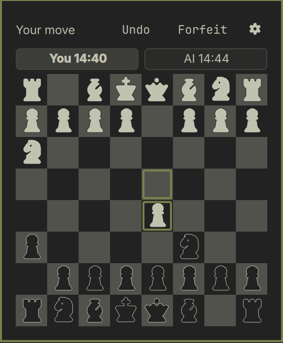
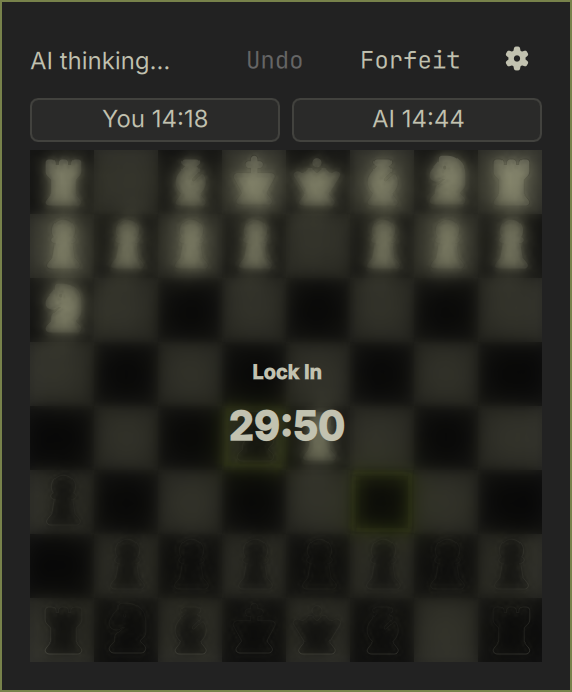

# OmaChess

Chess against a built-in AI, in your bar. Full rules, undo, clocks, and a
focus timer that makes you sit with your move. Everything is drawn from your
active shell theme — board, pieces, controls — so it fits whatever desktop
you've put together rather than imposing its own.



## Why

Most chess apps are built for someone who already wants to play chess. This
one is built for the other case: you want to *stop* thinking for a while.

Make a move, and the board blurs. A **Lock In** timer runs while the AI
thinks, and the board stays unusable until it finishes. It's a small, bounded
reason to put the phone down — chess as a focus block rather than a
distraction.



## Install

```sh
omarchy plugin add https://github.com/Veilios/omachess.git
omarchy restart shell
```

## Play

Click the knight in the bar, or summon it from anywhere:

```sh
omarchy-shell shell toggle veilios.omachess
```

The same command closes it.

## Settings

Behind the gear icon.

| Setting | Options | Default | Takes effect |
| --- | --- | --- | --- |
| Side | White / Black | White | next game |
| Clock | Off, 10, 15, 30, 90 min | 30 min | next game |
| Focus timer | On / Off | On | next game |
| Lock In length | 10, 15, 30, 60, 120 min | 10 min | next game |
| Notifications | On / Off | On | immediately |
| Undo | Off, 3, 5, 10, unlimited | unlimited | immediately |

Anything that waits for the next game marks the panel **Unsaved** until you
start one.

Undo takes back **your** last move — one ply while the AI hasn't replied, two
once it has, so either way you land where you were before it was your turn
again. The cap is spent per press, not per ply, and both your remaining
allowance and the position history survive a shell restart.

Clocks are not rewound by an undo. There is no per-ply snapshot to restore
from, so time already spent stays spent.

## Under the hood

- **A real rules engine.** `ChessEngine.js` implements castling, en passant,
  promotion and the draw rules, and is validated by [perft][perft] against
  published node counts — `node test/perft.js` walks millions of positions
  and checks the totals.
- **An AI that can't freeze your bar.** Negamax with alpha-beta pruning,
  MVV-LVA ordering, and iterative deepening, sliced across timer ticks against
  a node budget so the UI thread keeps breathing while it thinks.
- **Undo as position history, not a move stack.** Positions are stored as
  FENs, which is what lets undo survive a restart — the engine's internal
  stack is memory-only.
- **Drawn from your theme.** Board tones, pieces, and every control colour
  come from the active shell theme, so it doesn't look bolted on.

[perft]: https://www.chessprogramming.org/Perft_Results

## Development

```sh
node test/perft.js
```

## License

MIT